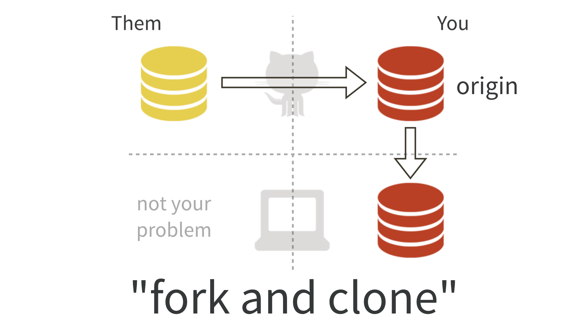

# Introduction {#intro} 

## Goals

This book is a joint effort of the course "Tools and Programming Languages for Data Science", FH Kiel. We develop this book, in order to learn how typical data wrangling tasks can be solved using the programming language R and in order to practice collaborative programming workflows using Git and GitHub. 

All of the R packages that we are going to cover are already extensively documented in books, online, and R help files. Our mission for this book is to investigate what these packages are good for, think about good example use cases in the context of data that we know, and apply their functionalities to these data.

- We start with core tidyverse packages that facilitate the data science workflow: tidying the data using the [tidyr](#tidyr) package, and exploring the data using the [dplyr](#dplyr) package.
- We work on tidyverse packages dedicated for specific data types: [stringr](#stringr) for text data, [lubridate](#lubridate) for dates and times, and [forcats](#forcats) for categorical variables.
- If data sets are huge we may run into performance problems. Hence, we explore the advantages of the [data.table](#data.table) package for high performance computing in R.

## Data
The whole book is supposed to be based on the data contained in the _data_ subdirectory. Please ask me if you would like to add another data set (e.g. because it would allow you to better demonstrate the functionalities of your package). Currently, the following data sets are covered:

- **diamonds**: data on diamonds; 50000 rows; categorical and numeric variables
- **spotify-charts-germany**: German daily top 200 charts for one year; 70000 rows; mostly numeric variables and dates 
- **olympic-games**: data on olympic games medallists; 250000 rows, categorical and numeric data
- **recipes**: data on recipes; 60000 rows; character, date, and numeric variables related information
- **weather-kiel-holtenau**: weather data for Kiel-Holtenau in 10-Minute intervals for one year, 50000 rows; Date, time and numeric variables.


## Git and GitHub
We will work in teams of 2 students per topic. An important part of the book project is practicing collaborative workflows using Git and Github. We will use the Forking Workflow which is typical of open source projects. This involves the following steps:


{width=49%} {width=49%}


1. Fork the 'official' GitHub repository ("upstream"). This creates your own GitHub copy ("origin").
2. Clone your fork to your local system.
3. Connect your local clone to the upstream repo by adding a remote path.
4. Create a new local feature branch.
5. Make changes on the new branch and create commits for these changes.
6. Push the branch to your GitHub repo ("origin")
8. Open a pull request on GitHub to the upstream repository.
9. Your team mate reviews your pull request. Once approved, it is merged into the upstream repo.

**How to connect your local clone to the upstream repo?**

```git
# Check the currently registered remote repositories
git remote -v    

# Add the upstream repo
git remote add upstream https://github.com/tillschwoerer/R-data-science-book.git 
```

**How can I integrate changes in the upstream repo into my local system?**

Best practice is to regularly pull upstream changes into the _master branch_ of your local system, and then create a new _feature branch_, in which you make your own edits and commits. Never edit the master yourself. If you follow this routine, the pull won't cause any conflicts - it will be a so called fast forward merge.

To be on the save side use `git pull upstream master --ff-only`. The `--ff-only` flag means that the upstream changes are merged into the master only if it is a fast forward merge. If you have accidently made commits to the master, you will get an error message. In this case follow the steps described [here](https://happygitwithr.com/upstream-changes.html#touched-master) to resolve the conflict.

Further literature:

- https://happygitwithr.com/fork-and-clone.html
- https://www.atlassian.com/git/tutorials/comparing-workflows/forking-workflow

